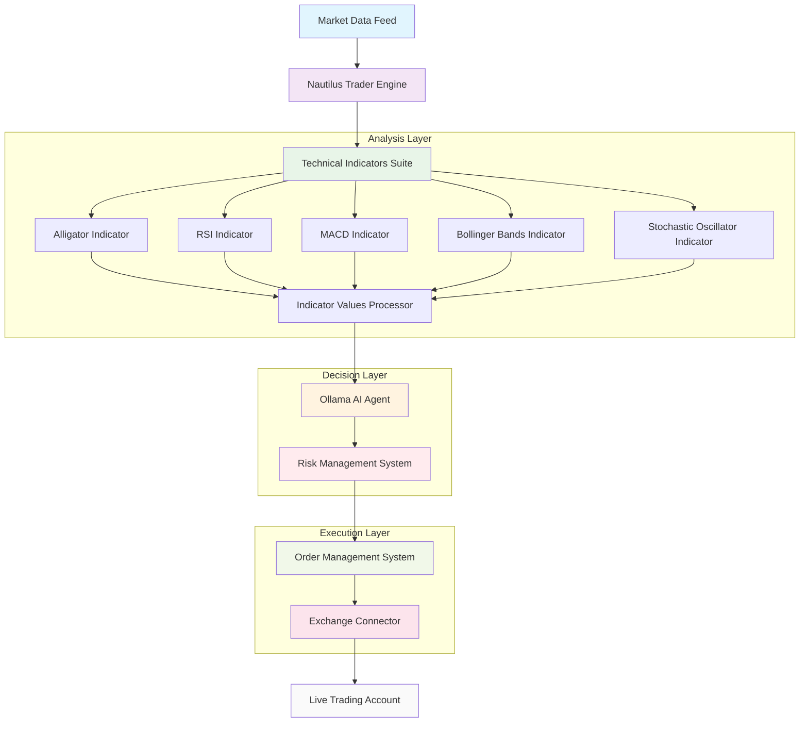
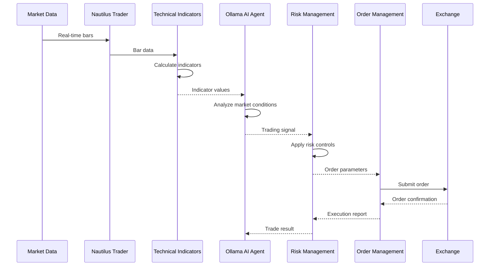

# Enhanced Alligator Strategy Architecture

## Component Diagram



## Data Flow Sequence



## Class Structure

```mermaid
classDiagram
    class Strategy {
        +config: EnhancedAlligatorConfig
        +instrument: Instrument
        +alligator: AlligatorIndicator
        +rsi: RSIIndicator
        +macd: MACDIndicator
        +bollinger_bands: BollingerBandsIndicator
        +stochastic: StochasticIndicator
        +ai_agent: OllamaAgent
        +risk_manager: RiskManager
        +on_start()
        +on_bar(bar: Bar)
        +on_stop()
        +buy()
        +sell()
        +close_position()
    }
    
    class EnhancedAlligatorConfig {
        +instrument_id: InstrumentId
        +bar_type: BarType
        +trade_size: Decimal
        +ai_model: str
        +risk_params: RiskParams
    }
    
    class OllamaAgent {
        +model: str
        +host: str
        +port: int
        +analyze_market(context: MarketContext)
        +make_decision(indicators: IndicatorValues)
    }
    
    class RiskManager {
        +max_position_size: Decimal
        +max_drawdown: Decimal
        +volatility_adjustment: bool
        +calculate_position_size(account_info: AccountInfo)
        +check_risk_limits(signal: TradingSignal)
    }
    
    class MarketContext {
        +current_price: float
        +indicator_values: dict
        +account_info: AccountInfo
        +open_positions: list
        +historical_performance: dict
    }
    
    Strategy --> EnhancedAlligatorConfig
    Strategy --> OllamaAgent
    Strategy --> RiskManager
    Strategy --> MarketContext