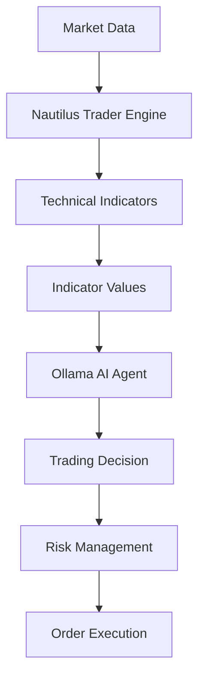

# Enhanced Alligator Strategy with AI Integration

## Overview
This document outlines the plan for creating an enhanced Alligator trading strategy that combines the Nautilus Trader platform with Ollama AI agent for improved trading accuracy and profitability.

## Architecture

### Components
1. **Nautilus Trader Core** - Trading engine and infrastructure
2. **Alligator Indicator** - Custom implementation of Bill Williams' Alligator
3. **Additional Technical Indicators**:
   - RSI (Relative Strength Index)
   - MACD (Moving Average Convergence Divergence)
   - Bollinger Bands
   - Stochastic Oscillator
4. **Ollama AI Agent** - Local AI decision maker
5. **Risk Management System** - Advanced position sizing and portfolio management

### Data Flow

## Implementation Plan

### Phase 1: Indicator Integration
1. Integrate RSI indicator from Nautilus Trader
2. Integrate MACD indicator from Nautilus Trader
3. Integrate Bollinger Bands indicator from Nautilus Trader
4. Integrate Stochastic Oscillator indicator from Nautilus Trader

### Phase 2: AI Agent Development
1. Create Ollama agent interface
2. Implement market analysis prompt generation
3. Add decision validation and fallback mechanisms

### Phase 3: Risk Management Enhancement
1. Implement dynamic position sizing based on volatility
2. Add portfolio-level risk controls
3. Implement drawdown protection mechanisms

### Phase 4: Continuous Learning
1. Add trade result tracking
2. Implement performance analysis
3. Create adaptive strategy adjustment

## Technical Details

### Indicators Configuration
- **Alligator**: 
  - Jaw: 13-period SMA, shifted 8 bars
  - Teeth: 8-period SMA, shifted 5 bars
  - Lips: 5-period SMA, shifted 3 bars
- **RSI**: 14-period
- **MACD**: 12, 26, 9 periods
- **Bollinger Bands**: 20-period, 2 standard deviations
- **Stochastic**: 14, 3 periods

### AI Decision Making
The AI agent will analyze:
1. Current market conditions
2. Technical indicator signals
3. Portfolio status
4. Historical performance
5. Risk metrics

### Risk Management Features
1. Dynamic position sizing based on account equity and market volatility
2. Maximum drawdown limits
3. Correlation-based portfolio risk controls
4. Time-based trading filters

## Expected Benefits
1. Improved trading accuracy through multi-indicator confluence
2. Better risk-adjusted returns through AI-enhanced decision making
3. Adaptive strategy that learns from market conditions
4. Robust risk management protecting capital

## Testing Strategy
1. Backtesting with historical data
2. Forward testing with paper trading
3. Gradual live trading with small positions
4. Continuous monitoring and optimization

## Deployment Plan
1. Initial development in sandbox environment
2. Integration with existing Nautilus Trader infrastructure
3. Testing with simulated market data
4. Gradual rollout to live trading with proper risk controls